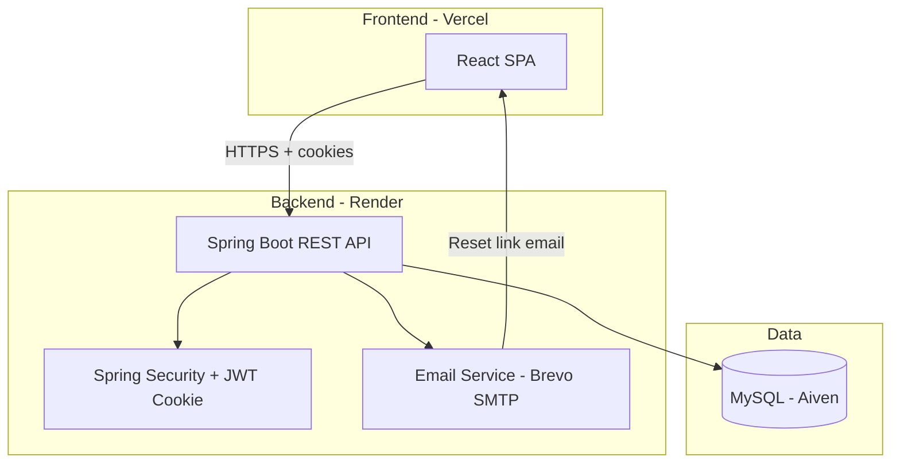

# ERP System — Enterprise Resource Planning Suite

A full-stack **Enterprise Resource Planning (ERP)** application for managing HR, Finance, Inventory, and Sales in one unified platform. Built with **Spring Boot** and **React**, designed for role-based access, secure authentication, and cloud deployment.

---

## Table of Contents

- [Overview](#overview)
- [Features](#features)
- [Tech Stack](#tech-stack)
- [Architecture](#architecture)
- [Project Structure](#project-structure)
- [User Roles](#user-roles)
- [Getting Started](#getting-started)
- [Deployment](#deployment)
- [Email (Brevo SMTP)](#email-brevo-smtp)
- [Environment Variables](#environment-variables)
- [API Documentation](#api-documentation)
- [Screenshots](#screenshots)
- [Roadmap](#roadmap)
- [Contributing](#contributing)
- [License](#license)

---

## Overview

This ERP system helps small and mid-sized businesses centralize day-to-day operations:

- **HR** — employees, departments, attendance, leave management  
- **Finance** — chart of accounts, transactions, expenses  
- **Inventory** — products, stock, purchase orders, suppliers  
- **Sales** — customers, orders, invoices, payments  
- **Administration** — audit logs, user profiles, session settings  

The app uses **JWT authentication** stored in **HttpOnly cookies** (XSS-safe), **role-based access control (RBAC)** on the backend, and a modern responsive UI with **dark mode** support.

| Layer        | Technology                          |
|-------------|--------------------------------------|
| Frontend    | React 19, Vite, Tailwind CSS 4       |
| Backend     | Java 21, Spring Boot 3.5, Spring Security |
| Database    | MySQL 8 (Aiven)                      |
| Deployment  | Render (API), Vercel (frontend)      |
| Email       | Brevo SMTP (password reset)          |

---

## Features

### Authentication & Security

- User registration and login (username or email)
- JWT in HttpOnly cookie (`SameSite=None`, `Secure`) for cross-origin production use
- **Forgot password** flow with email reset link (1-hour token expiry)
- Change password from profile when logged in
- BCrypt password hashing
- Method-level security with `@PreAuthorize` on sensitive endpoints
- CORS configured for Vercel → Render

### HR Management

- Employee CRUD and department management
- Daily attendance tracking (check-in / check-out)
- Leave requests with approval workflow
- Leave types initialized on startup

### Finance

- Chart of accounts
- Double-entry style transactions
- Expense tracking and reporting
- Role-restricted write access (`ACCOUNTANT`, `ADMIN`)

### Inventory

- Product catalog and categories
- Multi-warehouse stock levels
- Stock movement history
- Purchase orders with line items
- Supplier management
- Low-stock awareness on dashboard

### Sales

- Customer management
- Sales orders and order items
- Invoice generation
- Payment recording

### Administration & UX

- Dashboard with cross-module statistics
- Audit log viewer (admin only)
- User profile and session timeout settings
- Collapsible sidebar navigation
- Command palette, toast notifications, data caching
- Swagger / OpenAPI API docs
- Spring Actuator health endpoints

---

## Tech Stack

### Backend (`enterprise-system/`)

- Spring Boot 3.5 · Spring Data JPA · Spring Security  
- MySQL Connector · Hibernate  
- JWT (jjwt) · BCrypt  
- Spring Mail · Spring Validation · Springdoc OpenAPI  
- Lombok · Docker (Java 21)

### Frontend (`erp-system/`)

- React 19 · React Router 7  
- Vite 7 · Tailwind CSS 4  
- Axios · TanStack Table · Lucide Icons  

---

## Architecture



**Auth flow:** Login → JWT set in HttpOnly cookie → subsequent API calls send cookie automatically → 401 redirects to login.

---

## Project Structure

```
ERP_System/
├── enterprise-system/          # Spring Boot backend
│   ├── src/main/java/com/erp/enterprise/
│   │   ├── config/             # Security, CORS, OpenAPI
│   │   ├── controller/         # REST controllers (auth, hr, finance, inventory, sales)
│   │   ├── dto/                # Request/response objects
│   │   ├── entity/             # JPA entities
│   │   ├── repository/         # Spring Data repositories
│   │   ├── security/           # JWT filter, UserDetails
│   │   └── service/            # Business logic
│   ├── src/main/resources/
│   │   ├── application.properties
│   │   └── application-prod.properties
│   └── Dockerfile
│
├── erp-system/                 # React frontend
│   ├── src/
│   │   ├── api/                # Axios API clients
│   │   ├── components/         # UI components & layout
│   │   ├── context/            # Auth, theme, sidebar, cache
│   │   ├── hooks/
│   │   └── pages/              # Route pages by module
│   ├── vercel.json             # SPA rewrites for client routing
│   └── package.json
│
└── README.md                   # This file
```

---

## User Roles

| Role | Access |
|------|--------|
| `ROLE_ADMIN` | Full system access, audit logs, destructive actions |
| `ROLE_HR` | Employees, departments, attendance, leave |
| `ROLE_ACCOUNTANT` | Finance module (accounts, transactions, expenses) |
| `ROLE_SALES_STAFF` | Sales module (customers, orders, invoices, payments) |
| `ROLE_WAREHOUSE_STAFF` | Inventory module (products, stock, POs, suppliers) |
| `ROLE_MANAGER` | Elevated permissions (e.g. leave approval) |
| `ROLE_USER` | Default role for self-registered users |

**Demo users** (created on first startup if not present):

| Username | Email | Role |
|----------|-------|------|
| `admin` | admin@erp.com | ADMIN |
| `hr_user` | hr@erp.com | HR |
| `finance_user` | finance@erp.com | ACCOUNTANT |
| `sales_user` | sales@erp.com | SALES_STAFF |
| `inventory_user` | inventory@erp.com | WAREHOUSE_STAFF |

Passwords are set via environment variables (see [Environment Variables](#environment-variables)).

---

## Getting Started

### Prerequisites

- **Java 21** and **Maven 3.9+**
- **Node.js 18+** and **npm**
- **MySQL 8** (local or Aiven)

### 1. Clone the repository

```bash
git clone https://github.com/YOUR_USERNAME/ERP_System.git
cd ERP_System
```

### 2. Backend setup

```bash
cd enterprise-system
```

Create a local MySQL database and set environment variables (or edit `application.properties`):

```bash
# Windows PowerShell example
$env:DB_URL="jdbc:mysql://localhost:3306/erp_database?createDatabaseIfNotExist=true&useSSL=false&allowPublicKeyRetrieval=true&serverTimezone=UTC"
$env:DB_USER="root"
$env:DB_PASSWORD="your_mysql_password"
$env:JWT_SECRET="your-very-long-secret-key-minimum-64-characters-for-hs512-algorithm"
$env:ADMIN_PASSWORD="YourAdminPassword123"
$env:erp_dev_mode="true"   # optional: enables Demo@123 for local dev
```

Run the backend:

```bash
./mvnw spring-boot:run
# or on Windows:
mvnw.cmd spring-boot:run
```

API runs at **http://localhost:8080**  
Swagger UI: **http://localhost:8080/swagger-ui.html**

### 3. Frontend setup

```bash
cd ../erp-system
npm install
```

Create `.env.local` (optional):

```env
VITE_API_URL=http://localhost:8080/api
```

Run the frontend:

```bash
npm run dev
```

App runs at **http://localhost:5173**

---

## Deployment

### Backend — Render

1. Connect your GitHub repo to Render.
2. Create a **Web Service** using `enterprise-system/Dockerfile`.
3. Set environment variables (see table below).
4. Health check path: `/actuator/health`

### Frontend — Vercel

1. Import the `erp-system` folder (or monorepo with root directory `erp-system`).
2. Set `VITE_API_URL=https://YOUR-RENDER-APP.onrender.com/api`
3. Deploy — `vercel.json` handles SPA routing (`/login`, `/reset-password`, etc.).

### Database — Aiven MySQL

1. Create a MySQL service on Aiven.
2. Use SSL in JDBC URL: `jdbc:mysql://HOST:PORT/defaultdb?sslMode=REQUIRED`
3. Set `DB_URL`, `DB_USER`, `DB_PASSWORD` on Render.
4. Whitelist Render outbound IPs if required by Aiven.

### Production checklist

- [ ] `SPRING_PROFILES_ACTIVE=prod`
- [ ] `erp.dev.mode=false`
- [ ] Strong `JWT_SECRET` (64+ characters)
- [ ] `CORS_ALLOWED_ORIGINS` = your Vercel URL
- [ ] `FRONTEND_URL` = your Vercel URL
- [ ] Brevo SMTP configured for password reset emails
- [ ] `DDL_AUTO=validate` or `none` (recommended for production)

---

## Email (Brevo SMTP)

Password reset emails are sent through **Brevo** (formerly Sendinblue).

### Get Brevo SMTP credentials

1. Log in at [brevo.com](https://www.brevo.com).
2. Go to **Settings → SMTP & API → SMTP**.
3. Create an **SMTP key** (this is your password — not your Brevo login password).
4. Note your **SMTP login** (usually your Brevo account email).
5. Verify your **sender domain** or sender email under **Senders & Domains**.

### Brevo SMTP settings for this project

| Setting | Value |
|---------|--------|
| Host | `smtp-relay.brevo.com` |
| Port | `587` (use `2525` if Render blocks 587) |
| Username | Your Brevo SMTP login email |
| Password | Your Brevo **SMTP key** |
| From | Verified sender, e.g. `noreply@yourdomain.com` |

### Render environment variables

```env
MAIL_HOST=smtp-relay.brevo.com
MAIL_PORT=587
MAIL_USERNAME=your-brevo-login@email.com
MAIL_PASSWORD=your-brevo-smtp-key
MAIL_FROM=noreply@yourdomain.com
FRONTEND_URL=https://your-app.vercel.app
```

If mail is not configured locally, the reset link is **logged in the backend console** for testing.

---

## Environment Variables

### Backend (Render / local)

| Variable | Required | Description |
|----------|----------|-------------|
| `DB_URL` | Yes | MySQL JDBC connection string |
| `DB_USER` | Yes | Database username |
| `DB_PASSWORD` | Yes | Database password |
| `JWT_SECRET` | Yes | JWT signing secret (64+ chars) |
| `ADMIN_PASSWORD` | Yes | Password for bootstrap `admin` user |
| `CORS_ALLOWED_ORIGINS` | Prod | Comma-separated frontend URLs |
| `FRONTEND_URL` | Prod | Used in password reset email links |
| `MAIL_HOST` | Prod | SMTP host (`smtp-relay.brevo.com`) |
| `MAIL_PORT` | Prod | SMTP port (`587`) |
| `MAIL_USERNAME` | Prod | Brevo SMTP login |
| `MAIL_PASSWORD` | Prod | Brevo SMTP key |
| `MAIL_FROM` | Prod | Verified sender address |
| `SPRING_PROFILES_ACTIVE` | Prod | Set to `prod` |
| `DDL_AUTO` | Optional | `update` (dev) / `validate` (prod) |
| `erp.dev.mode` | Optional | `true` for local demo passwords |

### Frontend (Vercel / local)

| Variable | Required | Description |
|----------|----------|-------------|
| `VITE_API_URL` | Prod | Backend API base URL ending in `/api` |

---

## API Documentation

When the backend is running:

| Resource | URL |
|----------|-----|
| Swagger UI | `/swagger-ui.html` |
| OpenAPI JSON | `/v3/api-docs` |
| Health check | `/actuator/health` |

**Auth endpoints (public):**

- `POST /api/auth/login`
- `POST /api/auth/register`
- `POST /api/auth/logout`
- `POST /api/auth/forgot-password`
- `POST /api/auth/reset-password`
- `GET /api/auth/reset-password/validate?token=...`

---

## Roadmap

- [ ] Admin user management UI (reset passwords, assign roles)
- [ ] Email verification on registration
- [ ] PDF export for invoices
- [ ] Dashboard charts and analytics
- [ ] Flyway/Liquibase database migrations
- [ ] Unit and integration tests

---

## Contributing

1. Fork the repository  
2. Create a feature branch: `git checkout -b feature/my-feature`  
3. Commit changes: `git commit -m "Add my feature"`  
4. Push and open a Pull Request  

---

## License

This project is available for portfolio and educational use. Add your preferred license (e.g. MIT) if you plan to open-source it publicly.

---

## Author

**Your Name**  
GitHub: [@Karthikeyanm07](https://github.com/Karthikeyanm07)

---

<p align="center">
  Built with Spring Boot & React · Deployed on Render & Vercel
</p>
